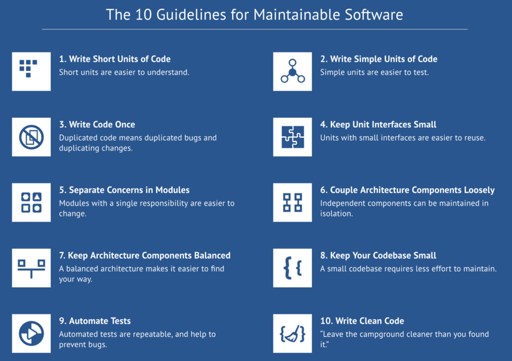

## Code Quality matters, even at the Odyssey hackathon

### A software engineering tale as old as time
So, let’s say you’re participating in the Odyssey Blockchain Hackathon, writing code as fast as possible. Awesome! But let’s pause for a moment and think about tomorrow.

Tomorrow is the day you have to build further with today’s code. You know how it goes. All last night’s mistakes get thrown right at your face. You might utter words like: _“Who wrote this code, I can’t work like this?!”_, only to realize it was actually YOU. You hack some more until it sort of works..., you think..., hope..., pray..., maybe..., for now...

Fast forward a few months. You hold your pitch, get some backing and build your prototype into a real-life working application, happily hacking along…, and then something breaks. You know what it is, you think. You quickly push a fix to production, and all is well. 10 minutes later you get the next call, and before you know it you’re knee-deep in spaghetti code, trying to decipher last month’s code hieroglyphs. It all comes tumbling down…

### Better Code Hub team is here to help
Of course, this doom scenario is mostly an exaggeration, but more often than you might think it's the bitter reality. This is why we at the [Software Improvement Group](https://softwareimprovementgroup.com) preach good software quality, religiously. We believe a little bit of effort now, will save a lot of headaches down the road. And we’re helping out @ Odyssey hackathon in 2 steps:

__Step 1, getting the basics right__: [Better Code Hub](https://bettercodehub.com) provides a set of 10 basic rules to keep your code maintainable. Can you get a 10/10 score? [Last year 19 teams did it](https://hackernoon.com/writing-quality-code-under-time-pressure-62ebeb5f39c5) (That’s 30%), so you can too. Following these guidelines will go a long way to keep your code easy to maintain, also in the long run.

It’s good to know we didn’t just make this up. All the data and thresholds in our measurements are comparing your code against thousands of other systems we’ve seen in the past 19 years. If you pass a guideline, it means you’re doing better than the average developer out there. It’s science!

__Step 2, planning for the future__: For those scoring a 10, we’ll go one step further: We will look at your code, and during a 10 minute grill session we will determine whether your prototype makes technical sense going forward, instead of just looking pretty. This is the “mature prototype” bit on the hackathon canvas. It includes topics such as software architecture and non-functional stuff such as performance, reliability and security.

__Sneak preview__: One of the questions we’ll ask is: Will it scale? From a technical perspective of course, we don’t care about marketing talk! Handling thousands, millions of users/transactions is not always easy. A little preparation and thinking ahead will definitely save you a lot of problems going ahead.

Will you be at the Hackathon? Come by the Jedi corner to say hi, to pick our brain, or get grilled to earn the right to call your prototype "mature". We’re out in force: Me (Jan), Michiel, Jade, Luc, Bugra, Hugo and Reinier. We’re here to help, and we know all about software quality and architecture. It’s what we do!
