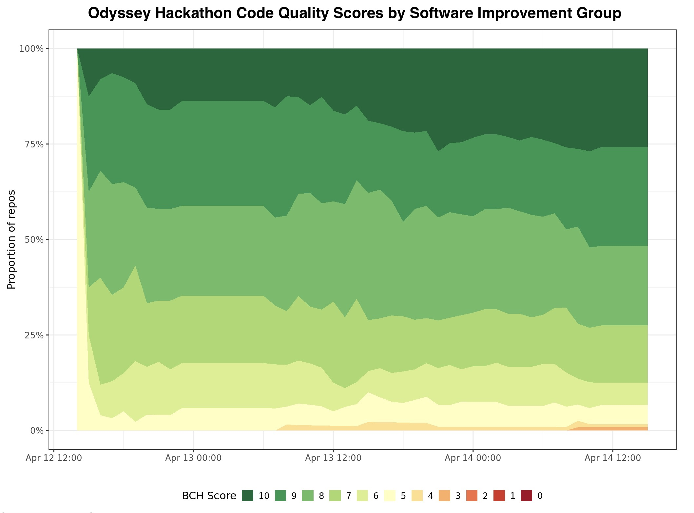
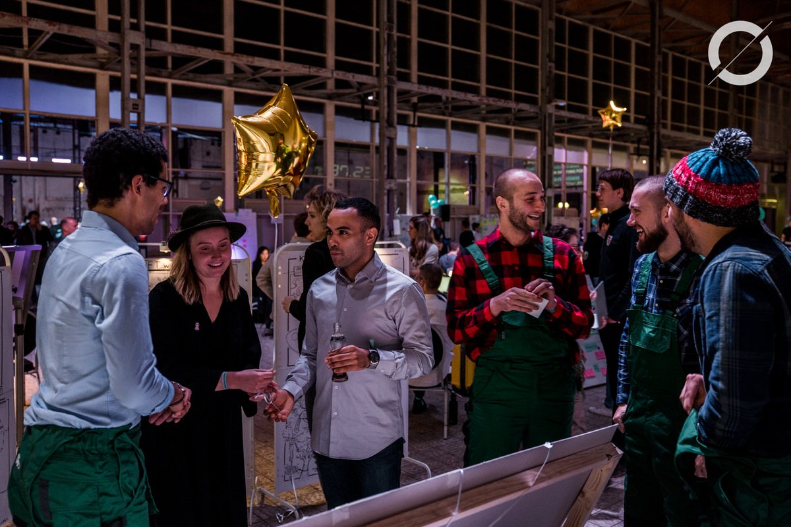

## Code Quality Odyssey
This weekend we were part of the worlds biggest BlockChain and AI Hackathon in the world: [Odyssey.org](https://odyssey.org). Writing maintainable code was an integral part of the jury process. It might seem strange but even at a Hackathon [code quality matters](/code-quality-matters.md)! One participant said "Even at a hackathon you can create technical dept that slows you down". 

100 teams were invited to work in GitHub private teams and created 140 (private) repos. Code quality was analysed for every puch to every repo starting at day 0. A whooping number of 7391 automated analyses where done with static code analyser [BetterCodeHub BCH](https://bettercodehub). 

Almost 25% of the repos scored a 10 out of 10 on the final day. Well done! For a list of all the individual scores please visit this [scoreboard](/scoreboard.md). The 10 guidelines are exlained [here](https://odysseyhack.github.io)

## Golden Balloon
The teams that scored a 10/10 were invited for a technical interview with 4 consultants of the [Software Improvement Group](https:/sig.eu). In these 'Grill sessions' the techleads were challenged on software engineering topics like why use Blockchain, how scalable is this architecture and how strong is your security. The price was golden.

## Future-proof code
Overall we were impressed by the technical quality of the tech leads during the grill sessions. It was great to be part of the hackathon vibe again. Looking forward to the future. 

Thank you for working with us.

Jan, Hugo, Bugra, Jade, Hugo, Reinier and [Michiel](https://github.com/michielcuijpers)
Software Improvement Group
